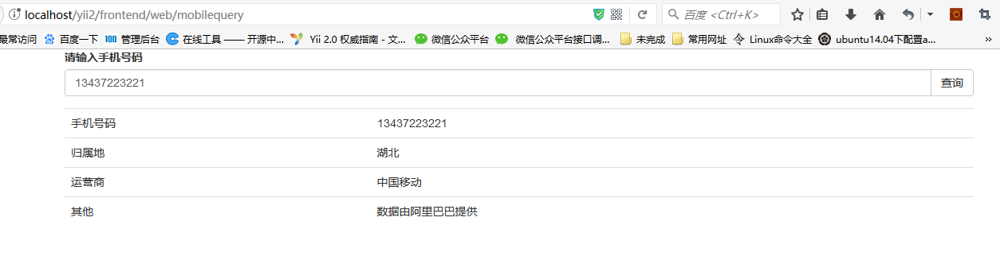

yii2-mobileQuery
================
yii2 extension for mobile phone number attribution inquiry

Installation
------------

The preferred way to install this extension is through [composer](http://getcomposer.org/download/).

Either run

```
php composer.phar require --prefer-dist klintlili/yii2-mobilequery "*"
```

or add

```
"klintlili/yii2-mobilequery": "*"
```

to the require section of your `composer.json` file.


config
-----
```
'components' => [
  ...
    'modules'=>[
      ...
      'mobilequery' => [
            'class' => 'klintlili\mobileQuery\Module',
        ]
      ...
    ]
  ...
  ]
```


Usage
-----

Once the extension is installed, simply use it in your browser by  :

```
http://localhost/yii2/frontend/web/mobilequery/default/index
```


ScreenShot
-----



